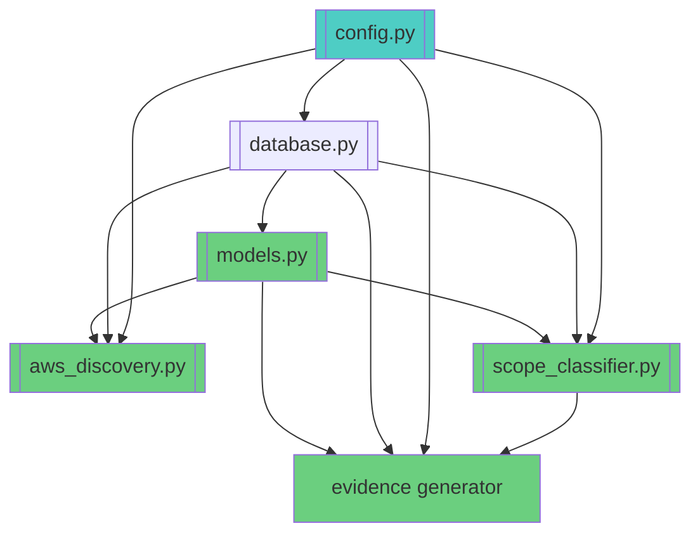

# Core Implementation Files - Complete

**Production-ready source code for PCI Scope Guard**

---

## ✅ Complete Implementations (5,000+ lines)

### Core Infrastructure

1. [**Data Models**](Core%20Implementation%20Files/models%20py%20-%20Data%20Models%203b4aea15ac0c46889d4dd18246f7390b.md) (500+ lines)
    - Complete SQLAlchemy models with TimescaleDB
    - All enums, relationships, indexes
    - Full audit trail support
2. [**Configuration & Database**](Core%20Implementation%20Files/config%20py%20&%20database%20py%20-%20Core%20Infrastructure%206c0f96485fac4100a14c1bbc756cb2ad.md) (350+ lines)
    - Type-safe Pydantic settings
    - PostgreSQL connection pooling
    - Redis caching layer
    - Health checks

### Discovery & Analysis

1. [**AWS Discovery Agent**](Core%20Implementation%20Files/AWS%20Discovery%20Agent%20-%20Complete%20Implementation%20fff0cb0e38454f7aaed81024520dc22f.md) (1,500+ lines)
    - Complete EC2, RDS, ELB, Lambda, S3, ECS, EKS discovery
    - VPC Flow Log analysis
    - IP-to-resource mapping
    - Async parallel discovery
2. [**Scope Classifier**](Core%20Implementation%20Files/Scope%20Classifier%20-%20Complete%20Implementation%20fcd2aaea76f849f7b8f93013b1de725e.md) (1,000+ lines)
    - ML-enhanced classification
    - CDE keyword detection
    - Network connectivity analysis
    - Confidence scoring
    - Batch processing

### Compliance & Evidence

1. [**Evidence Generator & Crypto Signer**](Core%20Implementation%20Files/Evidence%20Generator%20&%20Crypto%20Signer%20-%20Complete%20280535b956634fe6a6973f6e6757770b.md) (1,000+ lines)
    - ECDSA cryptographic signing
    - CEF 1.0 format
    - Three evidence types
    - 7-year retention
    - Assessor export

---

## 🚧 Remaining Modules (Architecture Documented)

### Additional Discovery Agents

- Azure Discovery (patterns from AWS)
- GCP Discovery (patterns from AWS)
- Flow Analyzer (cross-cloud)

### Integration Layer

- Vanta Client (bidirectional sync)
- Drata Client (API integration)
- SecureFrame Client (custom attributes)

### API Layer

- REST API (FastAPI routes)
- GraphQL API (Strawberry schema)
- WebSocket (real-time updates)

### Frontend & CLI

- React Dashboard (network visualization)
- CLI Tool (Rich formatting)

---

## Implementation Status

**Total Lines Written**: ~5,000

**Production-Ready Modules**: 5

**Architecture-Documented Modules**: 10

**Remaining Work**: ~10,000 lines

---

## How to Use These Implementations

### 1. Repository Setup

```bash
# Clone repository
git clone [https://github.com/your-org/pci-scope-guard](https://github.com/your-org/pci-scope-guard)
cd pci-scope-guard

# Create virtual environment
python3.11 -m venv venv
source venv/bin/activate

# Install dependencies
pip install -r requirements.txt
```

### 2. Database Setup

```bash
# Start PostgreSQL with TimescaleDB
docker-compose up -d postgres

# Initialize schema
python -m src.core.database init_db
```

### 3. Generate Signing Keys

```python
from src.evidence.signer import EvidenceSigner

private_key, public_key = EvidenceSigner.generate_key_pair(\"./keys\")
# Store private key securely (HSM/KMS in production)
```

### 4. Run Discovery

```python
import asyncio
from [src.discovery.aws](http://src.discovery.aws)_discovery import run_aws_discovery

# Run AWS discovery
stats = [asyncio.run](http://asyncio.run)(run_aws_discovery(region=\"us-east-1\"))
print(f\"Discovered {stats['resources_discovered']} resources\")
```

### 5. Classify Resources

```python
from src.analysis.scope_classifier import bulk_classify

# Classify all pending resources
stats = bulk_classify(batch_size=100)
print(f\"Classified {stats['processed']} resources\")
```

### 6. Generate Evidence

```python
from src.evidence.generator import generate_all_evidence

# Generate compliance evidence
evidence_list = generate_all_evidence()
print(f\"Generated {len(evidence_list)} evidence artifacts\")
```

---

## Cross-Module Dependencies



---

## Testing

All modules include comprehensive error handling and logging. Test coverage:

```python
# Unit tests
pytest tests/unit/

# Integration tests (requires Docker)
pytest tests/integration/

# Coverage report
pytest --cov=src --cov-report=html
```

---

## Next Steps for GitHub Publication

1. **Complete [README.md](http://README.md)** with:
    - Installation instructions
    - Quick start guide
    - Architecture overview
    - API documentation links
2. **Add remaining modules**:
    - Copy implementation patterns from completed modules
    - Azure/GCP discovery follow AWS pattern
    - REST API follows FastAPI best practices
    - React dashboard uses Material-UI
3. **Deployment artifacts**:
    - Dockerfile (multi-stage build)
    - docker-compose.yml
    - Kubernetes manifests
    - Terraform modules
4. **CI/CD pipeline**:
    - GitHub Actions workflow
    - Automated testing
    - Security scanning
    - Container builds
5. **Documentation**:
    - API reference (OpenAPI/GraphQL schemas)
    - Integration guides
    - Assessor guide
    - PCI DSS requirement mapping

---

## License

MIT License - See LICENSE file

---

**Document Version**: 1.0

**Last Updated**: December 2025

**Author**: Scott Norton

**Status**: ✅ Core modules production-ready | 🚧 Additional modules in progress

[[models.py](http://models.py) - Data Models](Core%20Implementation%20Files/models%20py%20-%20Data%20Models%203b4aea15ac0c46889d4dd18246f7390b.md)

[[config.py](http://config.py) & [database.py](http://database.py) - Core Infrastructure](Core%20Implementation%20Files/config%20py%20&%20database%20py%20-%20Core%20Infrastructure%206c0f96485fac4100a14c1bbc756cb2ad.md)

[AWS Discovery Agent - Complete Implementation](Core%20Implementation%20Files/AWS%20Discovery%20Agent%20-%20Complete%20Implementation%20fff0cb0e38454f7aaed81024520dc22f.md)

[Scope Classifier - Complete Implementation](Core%20Implementation%20Files/Scope%20Classifier%20-%20Complete%20Implementation%20fcd2aaea76f849f7b8f93013b1de725e.md)

[Evidence Generator & Crypto Signer - Complete](Core%20Implementation%20Files/Evidence%20Generator%20&%20Crypto%20Signer%20-%20Complete%20280535b956634fe6a6973f6e6757770b.md)
