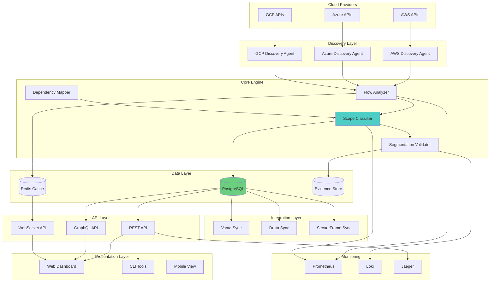
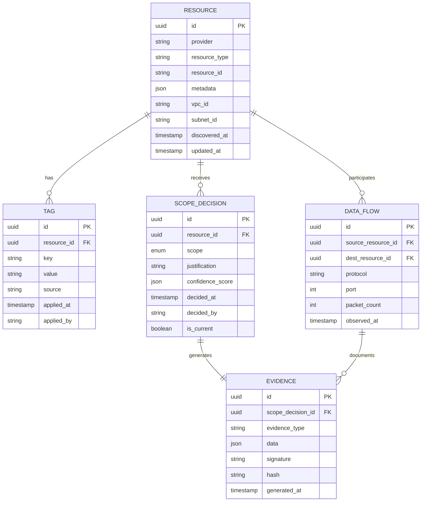
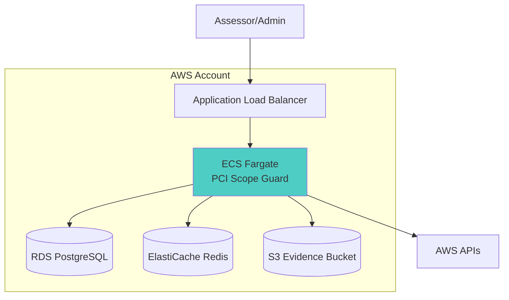
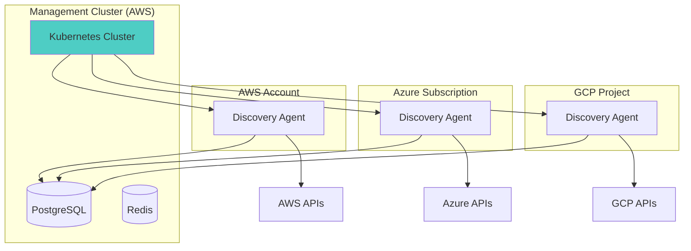
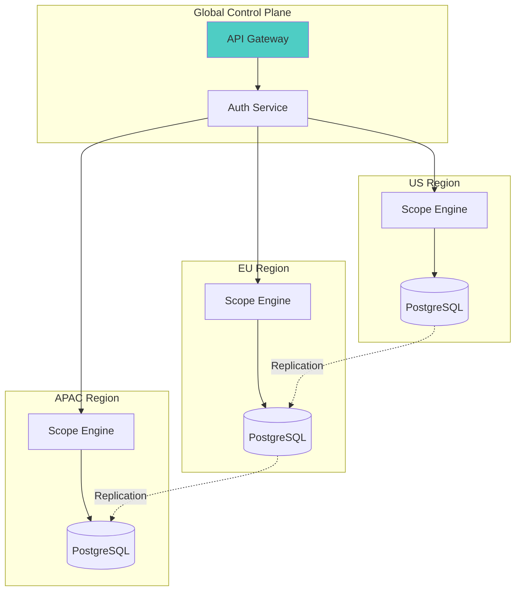
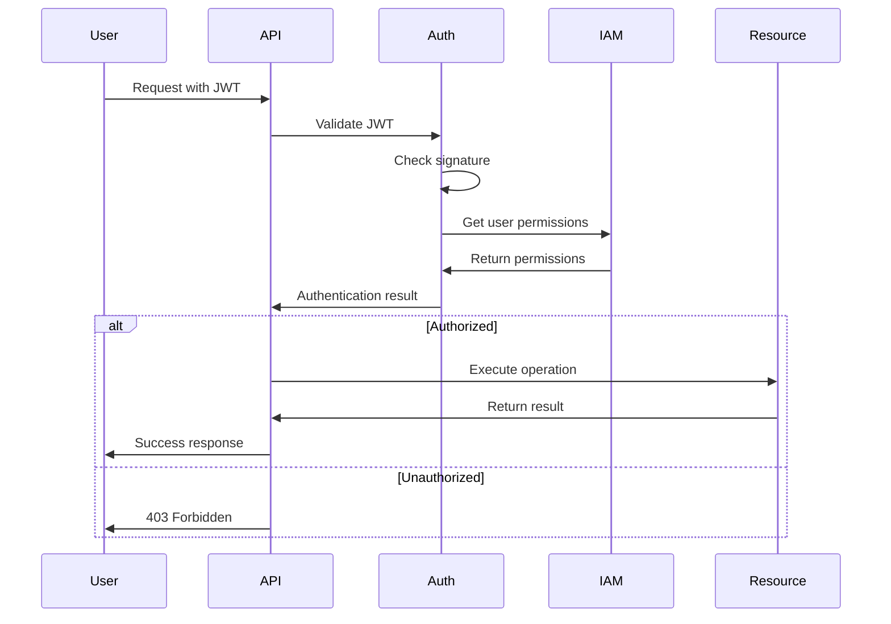
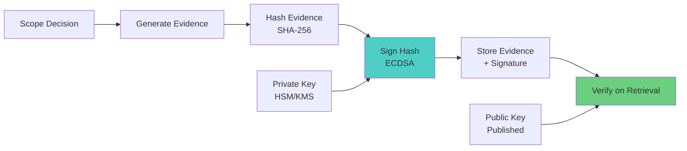

# Project Architecture & Repository Structure

**Complete Solution for Automated PCI DSS CDE Scope Identification**

---

## Project Name: **PCI Scope Guard**

**Tagline**: Automated Cardholder Data Environment boundary detection and continuous compliance monitoring for cloud infrastructure.

---

## Repository Structure

```
pci-scope-guard/
├── [README.md](http://README.md)
├── LICENSE
├── [CONTRIBUTING.md](http://CONTRIBUTING.md)
├── [CHANGELOG.md](http://CHANGELOG.md)
├── .gitignore
├── docker-compose.yml
│
├── docs/
│   ├── architecture/
│   │   ├── [system-design.md](http://system-design.md)
│   │   ├── [data-flow.md](http://data-flow.md)
│   │   ├── [security-model.md](http://security-model.md)
│   │   └── [deployment-patterns.md](http://deployment-patterns.md)
│   ├── guides/
│   │   ├── [quick-start.md](http://quick-start.md)
│   │   ├── [installation.md](http://installation.md)
│   │   ├── [configuration.md](http://configuration.md)
│   │   └── [user-guide.md](http://user-guide.md)
│   ├── api/
│   │   ├── [rest-api.md](http://rest-api.md)
│   │   ├── [graphql-schema.md](http://graphql-schema.md)
│   │   └── [webhooks.md](http://webhooks.md)
│   ├── integrations/
│   │   ├── [aws.md](http://aws.md)
│   │   ├── [azure.md](http://azure.md)
│   │   ├── [gcp.md](http://gcp.md)
│   │   ├── [vanta.md](http://vanta.md)
│   │   ├── [drata.md](http://drata.md)
│   │   └── [secureframe.md](http://secureframe.md)
│   └── compliance/
│       ├── [pci-dss-mapping.md](http://pci-dss-mapping.md)
│       ├── [evidence-formats.md](http://evidence-formats.md)
│       └── [assessor-guide.md](http://assessor-guide.md)
│
├── src/
│   ├── core/
│   │   ├── __init__.py
│   │   ├── [models.py](http://models.py)              # Data models
│   │   ├── [database.py](http://database.py)            # Database layer
│   │   └── [config.py](http://config.py)              # Configuration management
│   │
│   ├── discovery/
│   │   ├── __init__.py
│   │   ├── aws_[discovery.py](http://discovery.py)       # AWS resource discovery
│   │   ├── azure_[discovery.py](http://discovery.py)     # Azure resource discovery
│   │   ├── gcp_[discovery.py](http://discovery.py)       # GCP resource discovery
│   │   └── base_[discovery.py](http://discovery.py)      # Base discovery interface
│   │
│   ├── analysis/
│   │   ├── __init__.py
│   │   ├── flow_[analyzer.py](http://analyzer.py)       # Network flow analysis
│   │   ├── dependency_[mapper.py](http://mapper.py)   # Resource dependency mapping
│   │   ├── scope_[classifier.py](http://classifier.py)    # CDE scope classification
│   │   └── segmentation_[validator.py](http://validator.py)  # Network segmentation validation
│   │
│   ├── tagging/
│   │   ├── __init__.py
│   │   ├── tag_[manager.py](http://manager.py)         # Tag CRUD operations
│   │   ├── tag_[schema.py](http://schema.py)          # Tag schema validation
│   │   └── tag_[sync.py](http://sync.py)            # Tag synchronization
│   │
│   ├── integrations/
│   │   ├── __init__.py
│   │   ├── vanta_[client.py](http://client.py)        # Vanta API integration
│   │   ├── drata_[client.py](http://client.py)        # Drata API integration
│   │   ├── secureframe_[client.py](http://client.py)  # SecureFrame API integration
│   │   └── grc_[base.py](http://base.py)            # Base GRC interface
│   │
│   ├── monitoring/
│   │   ├── __init__.py
│   │   ├── drift_[detector.py](http://detector.py)      # Scope drift detection
│   │   ├── [alerting.py](http://alerting.py)            # Alert management
│   │   └── [metrics.py](http://metrics.py)             # Metrics collection
│   │
│   ├── evidence/
│   │   ├── __init__.py
│   │   ├── [generator.py](http://generator.py)           # Evidence artifact generation
│   │   ├── [signer.py](http://signer.py)              # Cryptographic signing
│   │   └── [exporter.py](http://exporter.py)            # Evidence export formats
│   │
│   ├── api/
│   │   ├── __init__.py
│   │   ├── rest/
│   │   │   ├── __init__.py
│   │   │   ├── [routes.py](http://routes.py)          # REST API routes
│   │   │   └── [schemas.py](http://schemas.py)         # Request/response schemas
│   │   ├── graphql/
│   │   │   ├── __init__.py
│   │   │   ├── [schema.py](http://schema.py)          # GraphQL schema
│   │   │   └── [resolvers.py](http://resolvers.py)       # GraphQL resolvers
│   │   └── websocket/
│   │       ├── __init__.py
│   │       └── [handlers.py](http://handlers.py)        # WebSocket handlers
│   │
│   ├── dashboard/
│   │   ├── __init__.py
│   │   ├── [app.py](http://app.py)                 # Dashboard web application
│   │   ├── static/                # Static assets
│   │   └── templates/             # HTML templates
│   │
│   └── cli/
│       ├── __init__.py
│       ├── [main.py](http://main.py)                # CLI entry point
│       └── commands/              # CLI commands
│           ├── [scan.py](http://scan.py)
│           ├── [report.py](http://report.py)
│           ├── [tag.py](http://tag.py)
│           └── [validate.py](http://validate.py)
│
├── tests/
│   ├── __init__.py
│   ├── unit/                      # Unit tests
│   ├── integration/               # Integration tests
│   ├── e2e/                       # End-to-end tests
│   └── fixtures/                  # Test fixtures
│
├── terraform/
│   ├── modules/
│   │   ├── aws-deployment/
│   │   ├── azure-deployment/
│   │   └── gcp-deployment/
│   └── examples/
│       ├── aws-production/
│       ├── azure-production/
│       └── gcp-production/
│
├── kubernetes/
│   ├── base/
│   │   ├── deployment.yaml
│   │   ├── service.yaml
│   │   └── configmap.yaml
│   └── overlays/
│       ├── development/
│       ├── staging/
│       └── production/
│
├── scripts/
│   ├── [setup.sh](http://setup.sh)                   # Initial setup script
│   ├── [deploy.sh](http://deploy.sh)                  # Deployment script
│   ├── [generate-keys.sh](http://generate-keys.sh)           # Generate signing keys
│   └── [migrate-db.sh](http://migrate-db.sh)              # Database migration
│
├── examples/
│   ├── aws-complete/              # Complete AWS example
│   ├── azure-complete/            # Complete Azure example
│   ├── gcp-complete/              # Complete GCP example
│   └── multi-cloud/               # Multi-cloud example
│
└── deployment/
    ├── docker/
    │   ├── Dockerfile.api
    │   ├── Dockerfile.worker
    │   └── Dockerfile.dashboard
    ├── helm/
    │   └── pci-scope-guard/
    └── cloudformation/
        └── stack.yaml
```

---

## System Architecture



---

## Technology Stack

### Backend

- **Language**: Python 3.11+
- **Framework**: FastAPI (REST/WebSocket)
- **GraphQL**: Strawberry GraphQL
- **Database**: PostgreSQL 15+ with TimescaleDB extension
- **Cache**: Redis 7+
- **Task Queue**: Celery with Redis broker
- **ORM**: SQLAlchemy 2.0+
- **Migrations**: Alembic

### Frontend

- **Framework**: React 18+ with TypeScript
- **UI Library**: Material-UI (MUI)
- **State Management**: Zustand
- **Data Fetching**: React Query
- **Visualization**: D3.js, Recharts, React Flow
- **Build Tool**: Vite

### Infrastructure

- **Container**: Docker
- **Orchestration**: Kubernetes
- **IaC**: Terraform, Pulumi
- **CI/CD**: GitHub Actions
- **Monitoring**: Prometheus, Grafana, Loki
- **Tracing**: OpenTelemetry, Jaeger

### Cloud SDKs

- **AWS**: boto3
- **Azure**: azure-sdk-for-python
- **GCP**: google-cloud-python

### Security

- **Signing**: cryptography (ECDSA)
- **Secrets**: HashiCorp Vault, AWS Secrets Manager
- **Auth**: OAuth2, JWT
- **Encryption**: AES-256-GCM at rest

---

## Data Models

### Core Entities



---

## Deployment Patterns

### Pattern 1: Single Cloud, Standalone



### Pattern 2: Multi-Cloud, Centralized



### Pattern 3: Distributed, Multi-Region



---

## Security Model

### Authentication & Authorization



### Cryptographic Evidence Chain



---

## API Design

### REST API Endpoints

```yaml
# Resource Management
GET    /api/v1/resources
GET    /api/v1/resources/{id}
POST   /api/v1/resources/scan
PATCH  /api/v1/resources/{id}/scope

# Scope Management
GET    /api/v1/scope/summary
GET    /api/v1/scope/decisions
POST   /api/v1/scope/classify
POST   /api/v1/scope/validate

# Evidence
GET    /api/v1/evidence
GET    /api/v1/evidence/{id}
POST   /api/v1/evidence/generate
GET    /api/v1/evidence/{id}/verify
GET    /api/v1/evidence/export

# Integrations
POST   /api/v1/integrations/vanta/sync
POST   /api/v1/integrations/drata/sync
GET    /api/v1/integrations/{provider}/status

# Monitoring
GET    /api/v1/monitoring/drift
GET    /api/v1/monitoring/violations
GET    /api/v1/monitoring/metrics
POST   /api/v1/monitoring/alerts
```

### GraphQL Schema

```graphql
type Query {
  resources(filter: ResourceFilter): [Resource!]!
  scopeSummary: ScopeSummary!
  evidence(id: ID!): Evidence!
  dataFlows(resourceId: ID!): [DataFlow!]!
}

type Mutation {
  classifyResource(input: ClassifyInput!): ScopeDecision!
  syncToGRC(provider: GRCProvider!): SyncResult!
  generateEvidence(scopeDecisionId: ID!): Evidence!
}

type Subscription {
  scopeChanges: ScopeChange!
  violations: Violation!
  newResources: Resource!
}
```

---

## Performance Targets

| Metric | Target | Measurement |
| --- | --- | --- |
| Resource Discovery | <5 min for 10,000 resources | Time to complete scan |
| Scope Classification | <10 sec per resource | Average processing time |
| API Response Time | <200ms p95 | API latency |
| Dashboard Load | <2 sec | Time to interactive |
| Evidence Generation | <1 sec | Time to generate + sign |
| Real-time Updates | <500ms | WebSocket latency |
| Database Queries | <100ms p95 | Query execution time |

---

## Scalability

**Horizontal Scaling:**

- API servers: Stateless, auto-scale based on CPU
- Workers: Scale based on queue depth
- Database: Read replicas for queries

**Capacity Planning:**

- 10,000 resources: Single instance
- 100,000 resources: 3-5 workers, read replicas
- 1,000,000+ resources: Distributed deployment, sharding

---

**Document Version**: 1.0

**Last Updated**: December 2025

**Author**: Scott Norton

**License**: MIT
